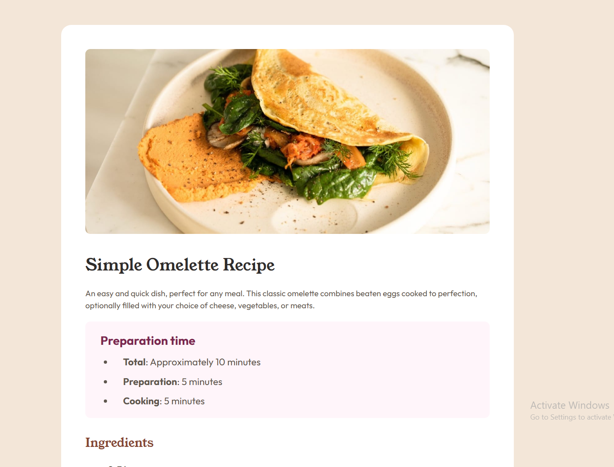

# Recipe Page

A responsive recipe page built as part of the Frontend Mentor challenge.  
This project focuses on structuring content-heavy layouts using semantic HTML and styling with CSS for readability, spacing, and visual hierarchy.

---

## 📸 Screenshot

(./screenshot-2.png)

---

## 🛠️ Built With

- HTML5
- CSS3
- CSS Variables
- Flexbox
- Responsive Design
- Mobile-first workflow

---

## 📌 Features

- Clean and structured recipe layout
- Organized sections for ingredients and instructions
- Styled typography for better readability
- Responsive design for mobile and desktop screens
- Well-spaced layout for content-heavy UI

---

## 📁 Project Structure


recipe-page-main/
├── index.html
├── style.css
├── images/
│ └── (recipe assets)
├── screenshot.png
└── README.md


---

## 📖 What I Learned

While building this project, I practiced:

- Structuring long-form content using semantic HTML
- Improving readability with typography and spacing
- Creating clean list-based layouts (ingredients & steps)
- Handling content-heavy UI designs
- Making layouts responsive without breaking structure

---

## 🚀 Future Improvements

- Add print-friendly version of recipe
- Improve accessibility (ARIA labels + semantic enhancements)
- Add dark mode variation
- Convert into a React recipe component

---

## 👨‍💻 Author

- GitHub: [@KhatiwadaR](https://github.com/KhatiwadaR)
```
